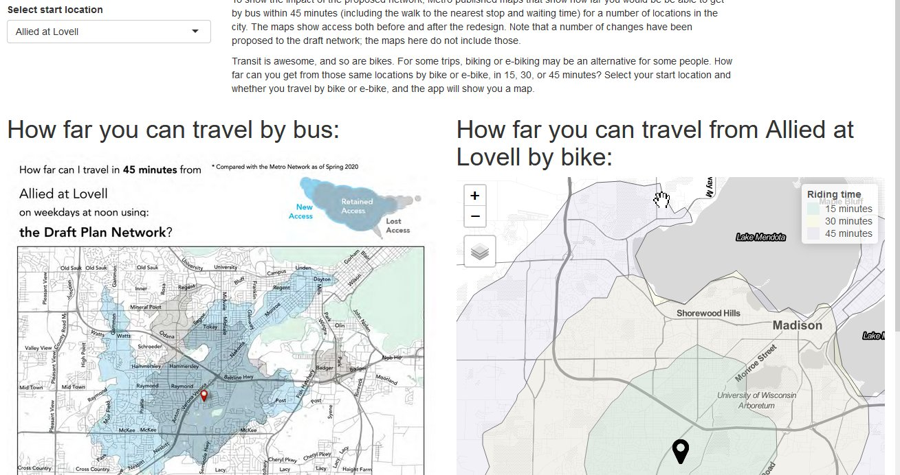

```{r setup, include=FALSE}
knitr::opts_chunk$set(echo = T)
library(sf)
library(dplyr)
library(tidyr)
```

Madison Metro is redesigning their bus network. As someone who is passionate about transit and as a member of the Transportation Commission, I have been following the project closely. When I saw a number of [isochrone maps](https://en.wikipedia.org/wiki/Isochrone_map) showing how far you can get by transit within 45 minutes, I was curious: How do those isochrones compare to ones by bike from the same location? I decided to build a Shiny app. This post provides some technical detail. To go straight to the map, click [here](https://haraldkliems.shinyapps.io/how-far-can-you-go/)

```{r fig.cap="Screenshot of the app", echo=F}

```


# Extracting the maps
Metro published the maps [as](https://madison.legistar.com/View.ashx?M=F&ID=10441390&GUID=ECA1CC37-55E7-48B3-9B26-37D4A6ADF11C) [appendices](https://www.cityofmadison.com/metro/documents/network-redesign/AdditionalIsochrones.pdf) in pdf format, with one map per page. With a large number of maps, extracting them manually and renaming each one seemed like a lot of work. Instead I let R handle the process.

Extracting the pages from the pdf as images is easy with the `magick` package. But how do you name the images in a way that reflects their location? So, for example, "Raymond at McKenna.png"? Well, all the maps have the name of the location in the same place on the page. And so can again use `magick` to crop the page to just that area and then use optical character recognition to extract the text.

The cropping required some of trial and error to get the area right. For example, I initially cropped the bottom of the area too close, leading to characters like "p" or "q" being mis-recognized as "o". But once the area was correct, the OCR worked almost flawlessly.

Here is the full function:

```{r eval=F}
read_page <- function(page, pdf_name){
  p <- image_read_pdf(pdf_name, pages = page, density = 600)
   location <- p %>% image_crop(geometry = "2400x200+60+385") %>% 
   image_ocr()
   path_name = paste0(str_sub(location, end = -2), ".png")
   image_write(p, path = path_name)
}
```

All that remains is then to iterate the function over the pages of the pdf files with `map`:

```{r eval=F}
map(1:pdf_info("data/AdditionalIsochrones.pdf")$pages, ~ read_page(page = ., pdf_name = "data/AdditionalIsochrones.pdf"))

```

# Isochrones with `openrouteservice`

Before we can generate isochrones, we need a shapefile of the start locations. I maybe could have used the names extracted in the previous step and run them through a geocoder to automate the process. Instead I put the locations on a map manually in QGIS and exported the locations as a geojson.

Next, we need a function that takes three inputs (location [`sf_point` object], type of vehicle, time range) and return a location (`sf_polygon`). 

```{r}
create_iso <- function(location, profile_1, range_1){
  iso <- ors_isochrones(locations = st_coordinates(location), 
                                 profile = ors_profile(mode = profile_1),
                                 range = range_1,
                       output = "sf")
  iso$geometry
}

```

The [OpenRouteService API has a limit of 5 locations per call](https://giscience.github.io/openrouteservice-r/reference/ors_isochrones.html), and so we create the isochrones one after the other with a `mutate` call. For this we need to set up the data frame of locations so that it has one row for each location, each vehicle type, and each time range.^[Another way to do this would have been to use `pmap`, iterating over the three parameters each.] 

```{r}
origins <- st_read("data/network_redesign_travel_time_map_locations.geojson")

origins_2 <- origins %>% 
  mutate(mode_ebike = "e-bike", 
         mode_bike = "bike", 
         time_15 = 900, 
         time_30 = 1800, 
         time_45 = 2700) %>% 
  pivot_longer(starts_with("mode"),
               names_to = "mode_var",
               values_to = "bike_type") %>% pivot_longer(starts_with("time_"),
                                                         names_to = "time_var", 
                                                         values_to = "time") %>% 
  select(-c(mode_var, time_var, id))

head(origins_2) %>% 
  kableExtra::kable()
```

Now we just run a `mutate` call with the `rowwise` function of dplyr and create isochrones for each row ^[Shoutout to the UW-Madison Data Science Hub team and [Martin Gal on StackOverflow](https://stackoverflow.com/questions/71877026/creating-multiple-isochrones-with-openrouteservice-r-for-a-dataframe-of-location) to help me figure out the `rowwise` step.] :

```{r eval=FALSE}
bike_isochrones <- origins_2 %>% 
  rowwise() %>% 
  mutate(iso = create_iso(geometry, bike_type, time))
```

We save the dataframe as an `RDS` file that we can then use in the app.

# The app
Now we have all the pieces in place for the Shiny app. To get a layout with the maps side-by-side I used the `fluidpage` way of designing the UI, which was pretty easy. 

The exception was the scaling of the bus map image. In the UI, the map is added with `imageOutput`, which takes a `width` and `height` parameter; on the server side, the image is generate with a `renderImage` call, which also takes dimension parameters. In theory, the Shiny UI should resize things dynamically based on the screen size, but in practice this was difficult to get right. Through trial-and-error I figured out a scaling that works on most screen sizes, but in some cases the image will still overlap other elements of the app.

Other than that, the code is pretty straightforward. You can see the latest version [here](https://github.com/vgXhc/network_redesign_isochrones/blob/main/how-far-can-you-go/app.R).